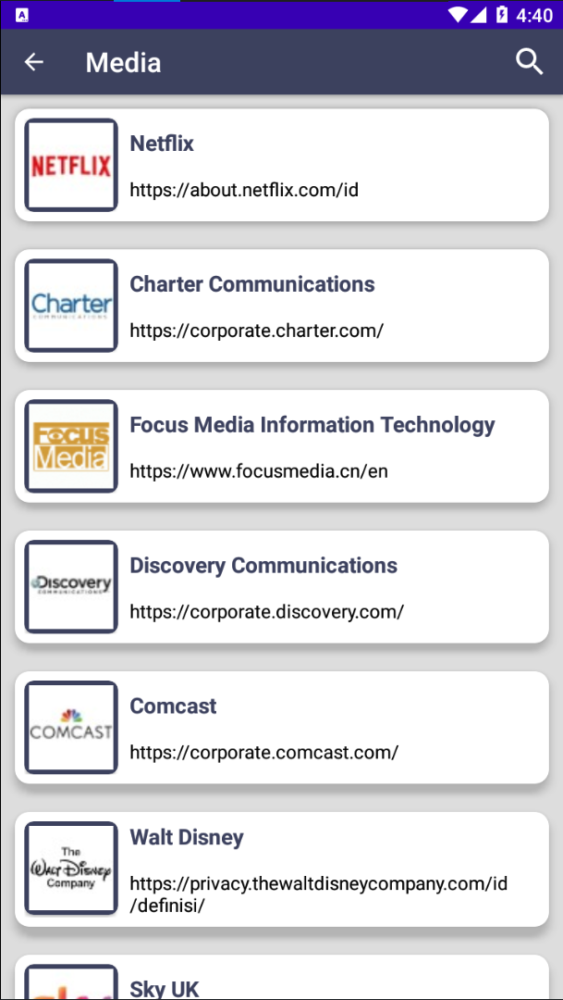

# mini-project-NadiaLayraAziza

# Dokumentasi Hasil Mini-Project-1

## 1. Halaman Home
Halaman home adalah halaman yang pertama kali muncul saat aplikasi dibuka/dijalankan.

Halaman Home

## 2. Halaman All List

Halaman All List

## 3. Halaman List pada Masing-Masing Kategori
Halaman-halaman ini akan muncul sesuai dengan kategori yang diklik pada halaman home.

List Kategori Media

List Kategori Semikonduktor

List Kategori Hardware dan Tech.Device

List Kategori Software dan Layanan IT

## 4. Halaman Detail Perusahaan
Halaman ini akan muncul ketika salah satu item list diklik.
<!-- 
 -->

Halaman Detail Perusahaan

<!-- 
 -->

## 5. Halaman Biodata Pendiri Perusahaan
Halaman ini akan muncul ketika meng-klik icon (profile) pada pojok kanan atas di halaman Detail Perusahaan.

Halaman Biodata Pendiri Perusahaan

## 6. Menu Search pada RecyclerView

Demo Menu Search

